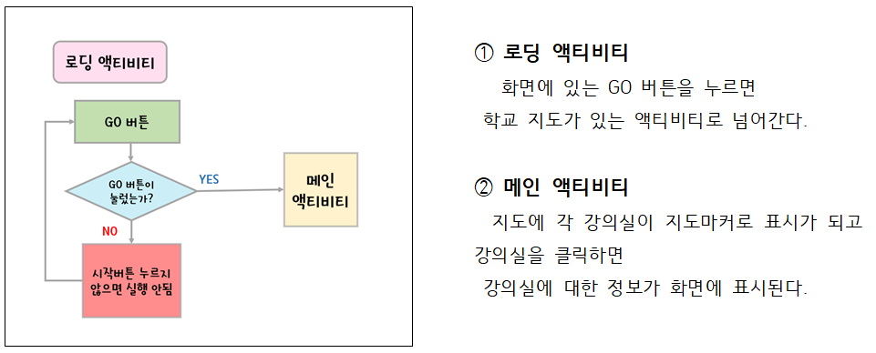
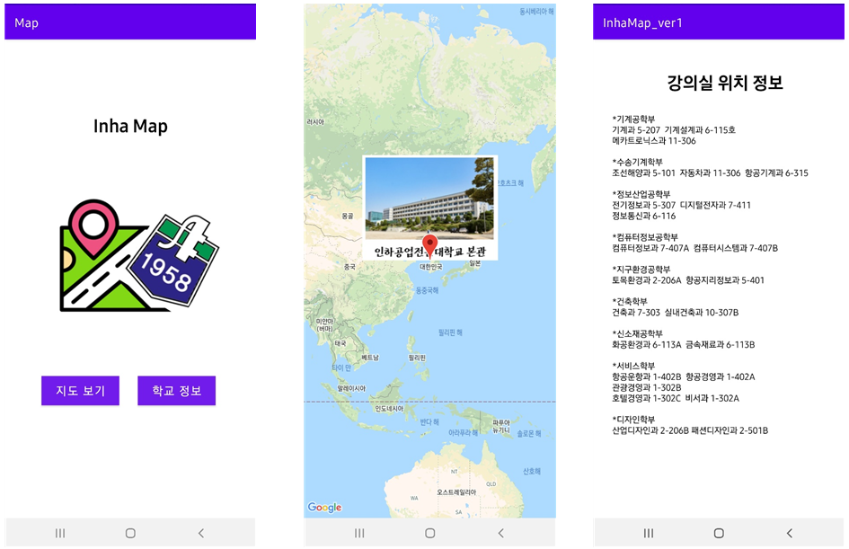
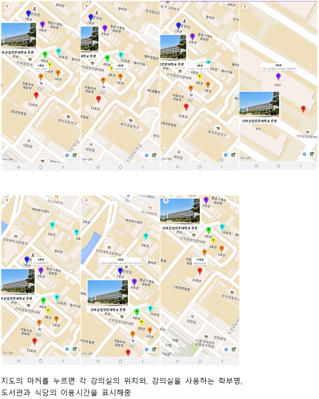

# InhaMap
2021-02 모바일프로그래밍 학교 지도 애플리케이션

 
 

## 📑 프로젝트 개요
▸ 강의실 및 학교 시설들의 위치 확인  
- 코로나로 인해 지속된 비대면 수업으로 학교를 오지 못하다가 위드 코로나로 전환되면서 대면수업을 하기 위해 캠퍼스를 처음 방문하거나 오랜만에 올 경우 길을 찾지 못하는 상황이 빈번하게 발생한다.  
- 이제는 수업을 듣기 위해서는 무조건 발열 컨테이너에 방문하여 체온을 확인 후 들어올 수 있다. 하지만 발열 컨테이너의 위치를 몰라 헤매는 학생들이 잦다.   

▸ 원활한 대학탐방 
- 우리학교에 입학을 하고 싶거나 학교 내부가 궁금하여 방문을 할 경우 우리학교 지도 애플리케이션을 사용하여 원활한 방문 및 대학 탐방이 가능해진다. 
 

## 📋 시스템 흐름도

 

## 💻 프로젝트 구현

### [ 초기 화면 ]

### [ 지도 ]

